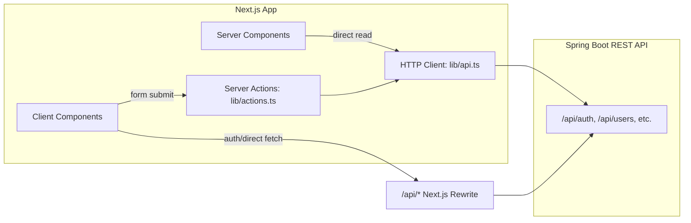

# Inventory Management System (IMS) — Next.js Frontend

A modern, responsive dashboard interface designed for SME (Small and Medium-sized Enterprises) inventory management. This application communicates with a Spring Boot REST API for authentication and data operations.

---

> [!IMPORTANT]
> ### 🔑 Demo Credentials
> You can log in and explore the system using the following demo account credentials:
> - **Username:** `Demo`
> - **Password:** `demo123`

---

## 🛠️ Technology Stack

- **Core:** Next.js 16 (App Router), React 19, TypeScript
- **Styling:** Tailwind CSS v4, shadcn/ui (Radix UI primitives)
- **State & Form Management:** React Hook Form + Zod validation
- **Data Tables:** TanStack Table (`@tanstack/react-table`) for flexible, feature-rich listings
- **Data Visualization:** Recharts for analytics and dashboard charts
- **Package Manager:** Bun
- **E2E Testing:** Playwright

---

## ✨ Key Features

1. **Secure Authentication & Session Management**:
   - Secure login via `/api/auth/login`.
   - Role-based routing: `SME_OWNER` (Admin) and `SME_STAFF` (Standard Staff).
   - Session persistence handled using backend-managed cookies.

2. **Dashboard Overview**:
   - High-level KPIs (Total Products, Total Stock Value, Out of Stock Items, Active Alerts).
   - Recent inventory movements list.
   - Live low-stock warning banners.
   - Interactive inventory status snapshots.

3. **Product Management (`/products`)**:
   - Comprehensive tabular listing with column ordering and pagination.
   - Creation of products with initial stock count (automatically creates starting stock ledger entry on the backend).
   - Detailed product view containing stock levels, safety thresholds, and movement history.

4. **Category Management (`/categories`)**:
   - Group products into categories to streamline organization.
   - Simple CRUD interface for categories.

5. **Stock Tracking & Movements Ledger (`/stock`)**:
   - Complete ledger displaying all inbound and outbound stock transactions.
   - Log new stock intake (`IN`), sales/dispatch (`OUT`), and manual adjustments (`ADJUSTMENT`).
   - Dedicated low stock tracking panel (`/stock/alerts`).

6. **User & Staff Management (`/users`)**:
   - View, invite, and edit system users (limited to accounts with the `SME_OWNER` role).

7. **Analytics (`/analytics`)** *(Admin only)*:
   - **Profitability Analysis:** Key financial performance graphs detailing product margins and category performance.
   - **Report Archival & Generation:** Instantly request PDF, CSV, or Excel report generation. View and download previously archived reports.

---

## 🏗️ Architecture

The app functions as a client-side layout shell that communicates with the Spring Boot Backend via Server Actions and Next.js rewrites.



### File Hierarchy & Roles

| Directory/File | Role | Description |
| :--- | :--- | :--- |
| `app/schemas/` | Validation | Zod schemas defining form validations (e.g. `auth.schema.ts`, `product.schema.ts`). |
| `types/` | Types | Domain models, custom type declarations, action result types. |
| `lib/api.ts` | HTTP | Client helper library for performing cookie-forwarded server-side fetches. |
| `lib/actions.ts` | Mutations | Next.js Server Actions used to trigger writes, updates, and handle path revalidation. |
| `lib/auth.ts` | Auth (Server) | Helpers to check session/user cookies server-side. |
| `components/auth-provider.tsx` | Auth (Client) | Syncs client-side user context via `/api/auth/me`. |
| `next.config.mjs` | Proxy | Configures rewrites redirecting client-side `/api/*` to the Spring Boot REST API. |

---

## 🚀 Getting Started

### Prerequisites

You need [Bun](https://bun.sh/) installed on your machine to manage packages and run scripts.

### Installation

1. Clone the repository and navigate to the project directory.
2. Install the application dependencies:
   ```bash
   bun install
   ```

### Configuration

Create a `.env.local` file in the root directory (you can copy `.env.example` as a starting point) and specify the Backend API URL:

```env
NEXT_PUBLIC_API_URL=https://api.ardaabaci.com
```

### Running Locally

To start the development server with Turbopack:

```bash
bun dev
```

Open [http://localhost:3000](http://localhost:3000) in your browser to view the application.

### Building for Production

To create an optimized production build:

```bash
bun run build
```

To run the production build locally:

```bash
bun start
```

### E2E Testing

Playwright is configured for End-to-End testing. 

Make sure you set the required test credentials in your environment or `.env` file first:
- `E2E_BASE_URL`
- `E2E_USERNAME`
- `E2E_PASSWORD`

Then use the following commands:
```bash
# Run tests headlessly
bun run test:e2e

# Run tests in the Playwright UI mode
bun run test:e2e:ui

# View the test report
bun run test:e2e:report
```
